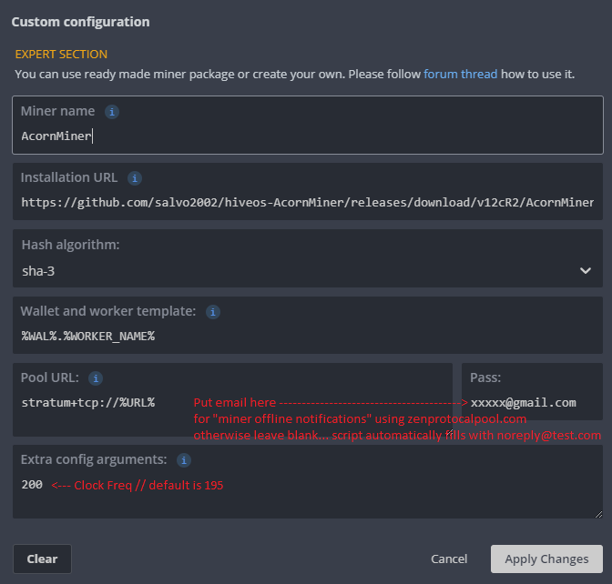

# AcornMiner HiveOS integration - Tribus Miner

## Keyboard shortcuts
(+) or (-) will increment or decrement core clock for all acorns

1-9 will select a specific acorn for commands to apply to

a reselects all acorns

t tunes teh Acron - should be supervised for temps!

d disabled

e enables

q quits

## Legend
F/A/I/R/L - Found, Accepted by the pool, Invalid (too high clocks?) Rejected by the pool, Low Difficulty (Acorn internal difficulty is lower than the pool, these are expected). A+I+R+L should = F

Acorns can run at a max of 125C before thermal shut down, and 110C for an extended period of time (I'd personally keep it <100C just to be safe)

Make sure you have the proper drivers installed before running any miner: http://www.squirrelsresearch.com/get-started-acorn/

## Exmaple Flight Sheet

